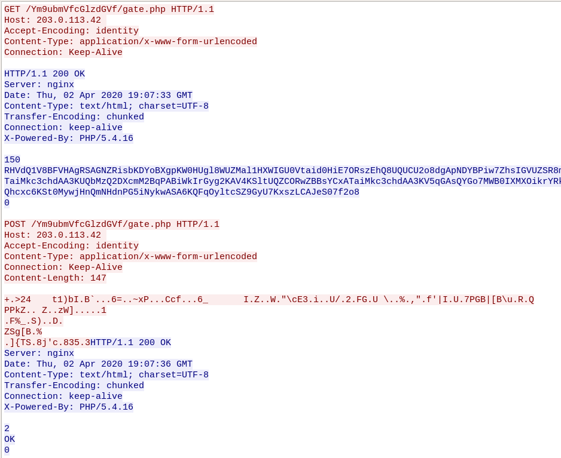

# FORENSIC - Chapardeur de mots de passe (200 pts)


L'énoncé nous était livré avec une capture de traffic réseau au format .pcap.


*Un ami vous demande de l'aide pour déterminer si l'email qu'il vient d'ouvrir au sujet du Covid-19 était malveillant et si c'était le cas, ce qu'il risque.
Il prétend avoir essayé d'ouvrir le fichier joint à cet mail sans y parvenir. Peu de temps après, une fenêtre liée à l'anti-virus a indiqué, entre autre, le mot KPOT v2.0 mais rien d'apparent n'est arrivé en dehors de cela.
Après une analyse préliminaire, votre ami vous informe qu'il est probable que ce malware ait été légèrement modifié, étant donné que le contenu potentiellement exfiltré (des parties du format de texte et de fichier avant chiffrement) ne semble plus prédictible. Il vous recommande donc de chercher d'autres éléments pour parvenir à l'aider.
Vous disposez d'une capture réseau de son trafic pour l'aider à déterminer si des données ont bien été volées et lui dire s'il doit rapidement changer ses mots de passe !*


## STEP1 - Collecte d'informations

Après avoir ouvert la capture dans Wireshark, on se retrouve face à 80000 trames, diverses IP et tout autant de protocoles, je détaille pas plus ici.

Donc le plus simple était de partir des informations connues afin de pouvoir identifier:
* l'IP de la victime
* l'IP vers laquelle sont potentiellemnet exfiltrées les données vollées

Une partie de l'énoncé semble bien mistérieuse, a priori au cours du challenge elle doit devenir plus claire ... pas pour moi :)

*Après une analyse préliminaire, votre ami vous informe qu'il est probable que ce malware ait été légèrement modifié, étant donné que le contenu potentiellement exfiltré (des parties du format de texte et de fichier avant chiffrement) ne semble plus prédictible.*

Donc, pour commencer une recherche google avec "KPOT 2.0" nous renseigne assez vite sur ce vilain malware et son fonctionnement, particulièrement ses échanges avec son C&C.

https://www.proofpoint.com/us/threat-insight/post/new-kpot-v20-stealer-brings-zero-persistence-and-memory-features-silently-steal

## STEP2 - Investigation

Il n'y a plus qu'à lancer une recherche en plein texte dans le contenu des trames, sous wireshark pour voir si une IP essaye de correspondre avec un C&C : "gate.php".
CTRL+F / Détail du paquet / chaîne de caractères.

Cela donne quelques résultats "HTTP 404" ou "HTTP 403" sauf pour la trame 7174.


On voit la réponse "HTTP 200 OK" ... ça commence à sentir bon, on peut noter dans un coin les IP.

Clic droit sur la première requête : suivre/flux TCP pour isoler la séquence et analyser l'échange dans une nouvelle fenêtre.



En reprenant le lien ci-dessus on peut comparer les trames.

1. GET /Ym9ubmVfcGlzdGVf/gate.php : la victime se "connecte" au C&C.
2. Réponse du C&C avec un contenu encodé en base64.
3. POST de la victime vers le C&C : le contenu exfiltré.

D'après la doc ci-dessus, les contenus sont simplements XORé avec une clef.

##STEP3 - Recherche de la clef

La réponse du C&C est sous un format connu :

	1111111111111100__DELIMM__A.B.C.D__DELIMM__appdata__GRABBER__*.log,*.txt,__GRABBER__%appdata%__GRABBER__0__GRABBER__1024__DELIMM__desktop_txt__GRABBER__*.txt,__GRABBER__%userprofile%\Desktop__GRABBER__0__GRABBER__150__DELIMM____DELIMM____DELIMM__

- 111000...11 : 16 bits qui correspondent à 16 commandes au malware
- __DELIM__ : délimitateur
- A.B.C.D : IP externe de la victime (on peut s'amuser à la chercher, je ne l'ai pas trouvée et puis il n'y en a pas besoin pour la suite :) )
- etc... cf le lien ci-dessus.


L'idée est donc une attaque par clair connu (ou presque, au pire on ajustera un peu la séquence de 1 et 0), en XORant cette séquence avec le contenu de la première réponse du C&C pour obtenir la clef : 
chiffré = clair^clef
chiffré^clair=clef

Un petit script

```python
#!/usr/bin/python

import base64

req1 = 'RHVdQ1V8BFVHAgRSAGNZRisbKDYoBXgpKW0HUgl8WUZMal1HXWIGU0Vtaid0HiE7ORszEhQ8UQUCU2o8dgApNDYBPiw7ZhsIGVUZSR8mEAJYGzM0Ng13JjNgajwUMxgGECUYEkETaiMkc3chdAA3KUQbMzQ2DXcmM2BqPABiWkIrGyg2KAV4KSltUQZCORwZBBsYCxATaiMkc3chdAA3KV5qGAsQYGo7MWB0IXMXOikrYRkAAT5FFhlUXA9UdzQyETcHBws8ajsxYHQhcxc6KSt0MywjHnQmNHdnPG5iNykwASA6KQFqOyltcSZ9GyU7KxszLCAJeS07f2o8'

knownplain = '0110101110111110__DELIMM__00.000.00.000__DELIMM__appdata__GRABBER__*.log,*.txt,__GRABBER__%appdata%__GRABBER__0__GRABBER__1024__DELIMM__desktop_txt__GRABBER__*.txt,__GRABBER__%userprofile%\\Desktop__GRABBER__0__GRABBER__150__DELIMM____DELIMM____DELIMM__'

req1 =  base64.b64decode(req1)
print len(req1)

clair = ''
for i in range(len(knownplain)):
	clair += chr(ord(req1[i]) ^ ord(knownplain[i]))

print clair


```

Et le résultat commence par une séquence intéressante : **tDlsdL5dv25c1Rhv**tDlsdL5dv27b....
Que l'on voit se répéter, on a notre clef.

Remarque : pour ce résultat j'ai du un peu tatonner pour avoir '0110101110111110' en début de 'clair connu'.
On peut commencer par 1111111111111111, utiliser la clef trouvée pour décoder la requête n°2 (exfiltration des données par le POST). Et en changeant judicieusement 0 et 1, on trouve un texte *human readable*. On garde alors la clef correspondante.

## STEP3 - Get the flag

Il n'y a plus qu'à XORé le contenu du POST avec la clef :

```python
#!/usr/bin/python

req2 = '\x2b\x00\x3e\x32\x34\x09\x74\x31\x29\x62\x49\x16\x42\x60\x18\x13\x01\x36\x3d\x06\x01\x7e\x78\x50\x1a\x13\x15\x43\x63\x66\x1b\x05\x01\x36\x5f\x09\x49\x1a\x5a\x10\x04\x57\x18\x22\x5c\x63\x45\x33\x00\x69\x1a\x1c\x55\x2f\x04\x32\x19\x46\x47\x06\x55\x20\x5c\x06\x11\x25\x19\x2c\x22\x0f\x66\x27\x7c\x49\x01\x55\x08\x37\x50\x47\x42\x7c\x5b\x42\x5c\x75\x0c\x52\x13\x51\x0d\x50\x50\x6b\x5a\x17\x17\x20\x5a\x15\x01\x7a\x57\x5d\x15\x02\x06\x00\x07\x31\x0d\x12\x46\x25\x5f\x12\x53\x29\x02\x05\x44\x02\x0d\x5a\x53\x67\x5b\x42\x16\x25\x0d\x16\x5d\x7b\x54\x53\x0b\x38\x6a\x27\x63\x13\x38\x33\x35\x11\x33'

key = 'tDlsdL5dv25c1Rhv' * 10

clair = ''
for i in range(len(req2)):
	clair += chr(ord(req2[i]) ^ ord(key[i]))
print clair
```

Et le résultat apparaît :

	_DRAPEAU_P|us2peurQue2M4l!  R4ssur3z-Votre-Am1-Et-vo1c1Votredr4peau_FCSC{469e8168718996ec83a92acd6fe6b9c03c6ced2a3a7e7a2089b534baae97a7}_DRAPEAU_
